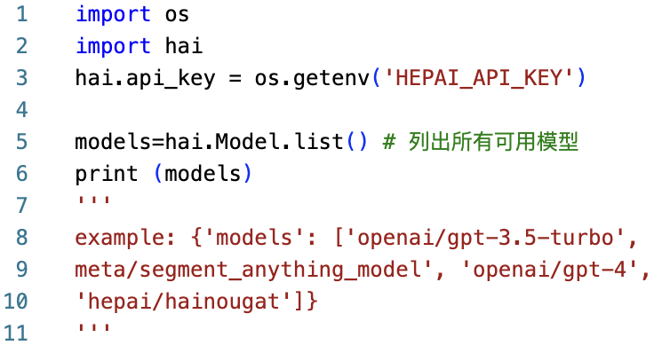
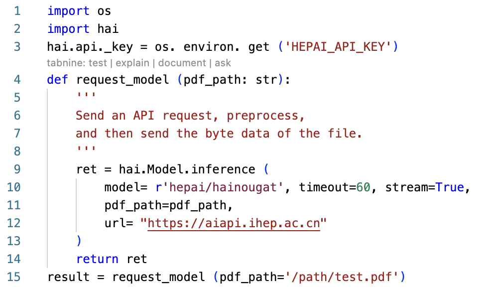

# Resquesting HaiNougat via Worker

**Obtaining and Configuring the API-KEY**
Users need to authenticate or sign up on the HepAI platform. After logging in, an API key is generated and should be set as the `HEPAI_API_KEY` environment variable.

**Accessing Models Permitted by the API-KEY**

As shown in figure below, using the API-KEY with the hepai library allows users to view all models they have access to, including both public and exclusive ones. This step requires installing the hepai library with `pip install hepai` to identify available models.

**Invoking HaiNougat**
To invoke the HaiNougat model, the user must use the API key and modify the `pdf_path` parameter to reflect the local path of the PDF file intended for processing. HaiNougat supports both streaming and non-streaming outputs. The invocation can be accomplished by calling the function as demonstrated in figure below.

